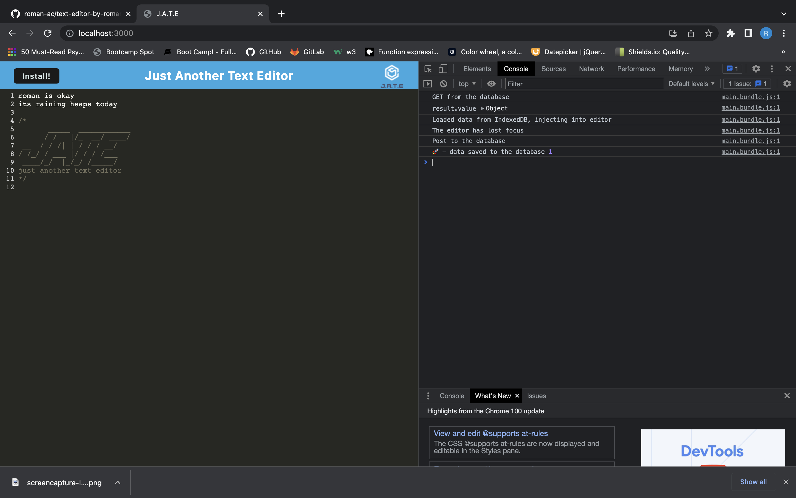
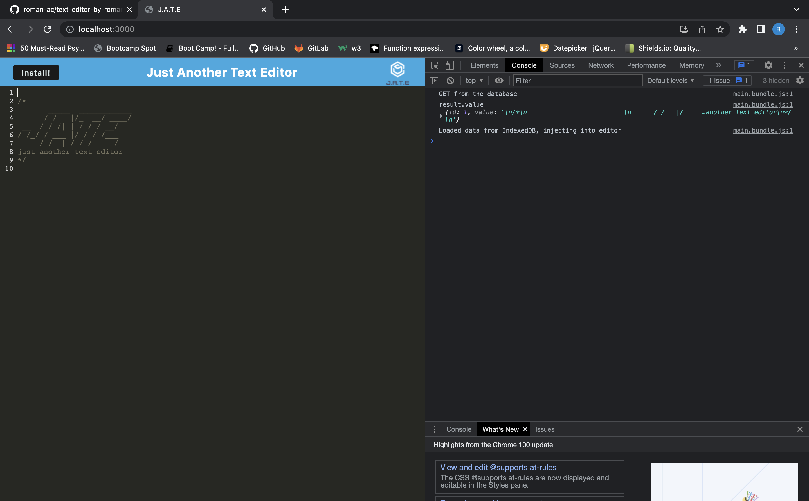
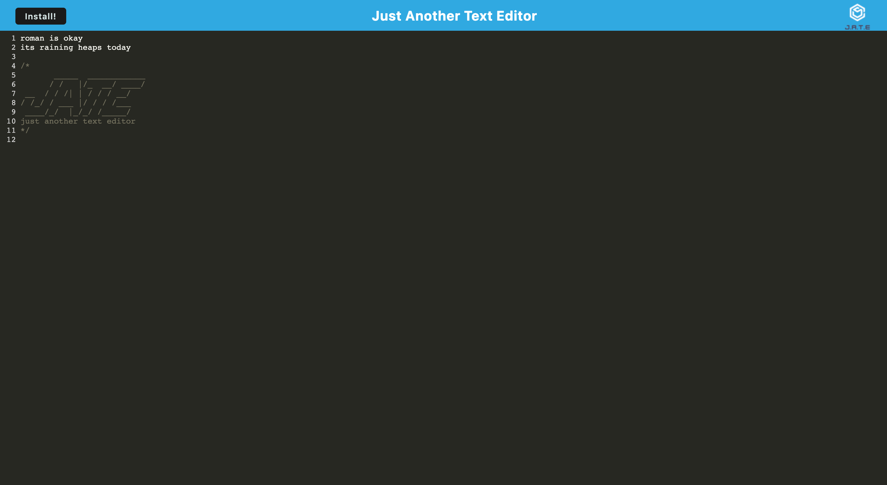

# Text-Editor

## Table of Contents
  * [User Story](#user-story)
  * [Mission](#mission)
  * [GITHUB page](#github-page)
  * [Demo Link](#demo-link)
  * [Screenshots](#screenshots)
  * [Contributors](#contributors)

## User Story

AS A social media startup, I WANT an API for my social network that uses a NoSQL database. So THAT my website can handle large amounts of unstructured data.
    

## Mission

    GIVEN a social network API

* WHEN I enter the command to invoke the application
    THEN my server is started and the Mongoose models are synced to the MongoDB database
* WHEN I open API GET routes in Insomnia for users and thoughts
    THEN the data for each of these routes is displayed in a formatted JSON
* WHEN I test API POST, PUT, and DELETE routes in Insomnia
  THEN I am able to successfully create, update, and delete users and thoughts in my database
* WHEN I test API POST and DELETE routes in Insomnia
  THEN I am able to successfully create and delete reactions to thoughts and add and remove friends to a user’s friend list

## GITHUB page

[Github](https://github.com/roman-ac/text-editor-by-roman-ac)

## Demo Link

[Google-Drive](https://drive.google.com/file/d/1RfZytvDCD3Ko0eFrGT3q_r40ulFNE6j7/view)

# Screenshots

  
  

  
  

  
  

## Contributors
  ### Reach out here: 
  [roman-ac](https://github.com/roman-ac)